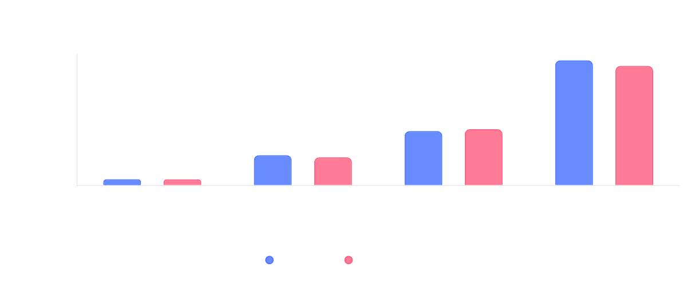

# Ollama Benchmark Tool

A comprehensive benchmarking tool for measuring and comparing the performance of different Ollama models across various prompts and scenarios.

## Features

- **Multi-Model Testing**: Test multiple Ollama models in sequence
- **Robust Error Handling**: 
  - Automatic retry mechanism with exponential backoff
  - Timeout protection
  - Graceful error recovery
- **Performance Metrics**:
  - Response time measurement
  - Token generation speed (tokens/sec)
  - Running averages and statistics
- **Progress Tracking**:
  - Real-time progress reporting
  - ETA calculation
  - Running statistics
- **Flexible Configuration**:
  - JSON-based configuration
  - Command-line parameter overrides
  - Customizable prompts and models

## Requirements

- Python 3.6 or higher
- Ollama installed and running
- Models downloaded in Ollama

## Installation

1. Clone this repository or download the files
2. Ensure Ollama is installed and running
3. Configure your models and prompts in `benchmark_config.json`

## Usage

### Basic Usage

Run the benchmark with default configuration:

```bash
python main.py
```

### Advanced Usage

Override configuration via command line:

```bash
python main.py --models llama2:latest qwen3:8b --timeout 120 --retries 5
```

Available command-line options:
- `--config`: Path to configuration file (default: benchmark_config.json)
- `--models`: Override models to test
- `--timeout`: Override timeout in seconds
- `--retries`: Override number of retry attempts
- `--output`: Override output file path

### Configuration

Edit `benchmark_config.json` to customize:
- Models to test
- Prompts to use
- Timeout settings
- Output file locations

Example configuration:
```json
{
  "models": [
    "gemma3:1b",
    "llama2:latest",
    "qwen3:8b"
  ],
  "prompts": [
    "What is the capital of Pakistan?",
    "A farmer has 17 sheep and all but 9 run away. How many are left? Explain step by step."
  ],
  "timeout_seconds": 60,
  "max_retries": 3,
  "output_file": "ollama_results.json",
  "log_file": "ollama_benchmark.log"
}
```

## Performance Visualization

### Performance Overview

*Figure 1: Overview of models Response Time on i5 12400 (test1) vs i5 12400 (test2)*

## Output

The benchmark generates two main output files:

1. `ollama_results.json`: Contains detailed results including:
   - Model responses
   - Timing information
   - Token counts
   - Timestamps

2. `ollama_benchmark.log`: Contains running log of:
   - Progress updates
   - Error messages
   - System status
   - Performance metrics

## Results Format

Each benchmark result includes:
```json
{
  "model": "model_name",
  "prompt": "prompt_text",
  "time_taken_sec": 1.23,
  "answer_length": 150,
  "estimated_tokens": 45,
  "tokens_per_sec": 36.58,
  "answer": "model_response",
  "timestamp": "2025-09-12T10:30:00"
}
```

## Error Handling

The tool handles various error scenarios:
- Network timeouts
- Model loading errors
- System resource constraints
- File I/O issues

Errors are logged and the tool attempts to continue with the next prompt/model when possible.

## Contributing

Feel free to open issues or submit pull requests for improvements. Some areas that could be enhanced:
- Additional performance metrics
- More accurate token counting
- GPU usage monitoring
- Parallel model testing
- Web interface for results visualization

## License

This project is open source and available under the MIT License.